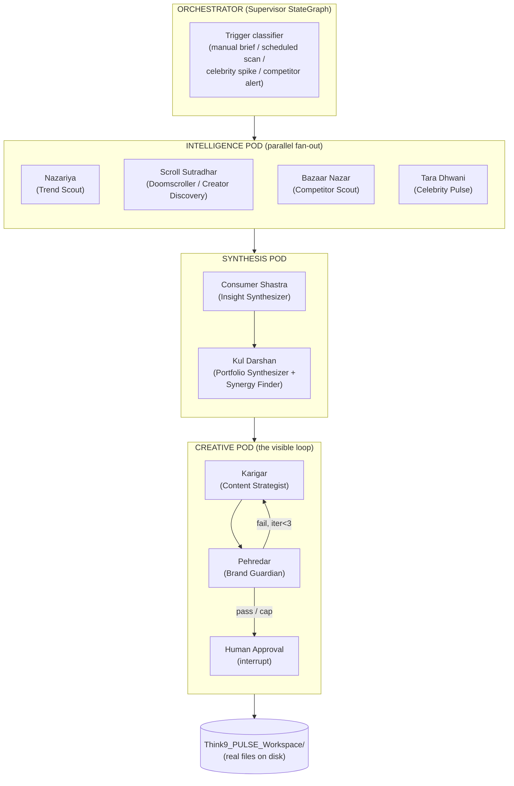
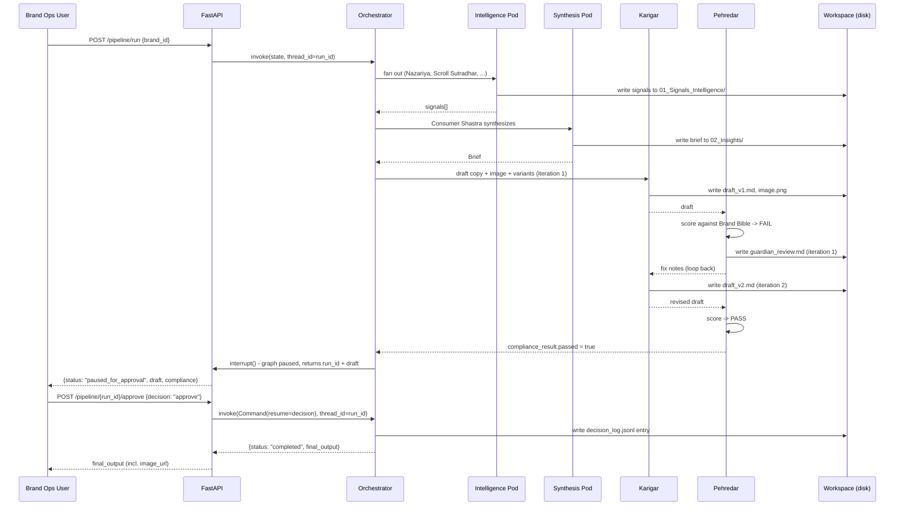
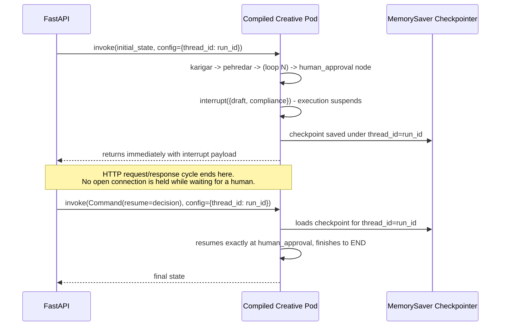
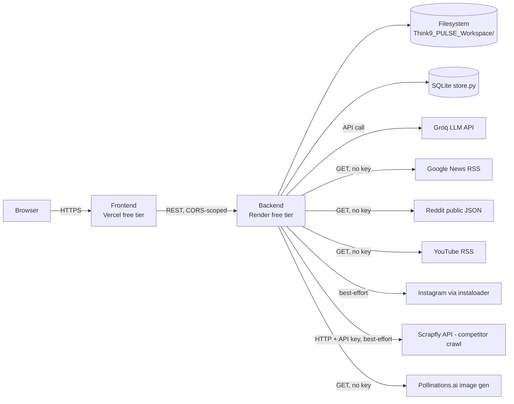

# Think9 PULSE — High-Level Design

*Portfolio Unified Learning & Signal Engine — a hierarchical multi-agent system unifying market/consumer intelligence and content/creative production across Think9's 30+ brand portfolio.*

Status: design finalized, implementation in progress. Deadline-driven build (2-day window); this document reflects the target architecture and is kept in sync with what is actually built (see `## Build Status` at the end, and `docs/PRD.md` §Scope for the P0/P1/P2 cut lines).

---

## 1. Problem & System Goals

Think9 runs an "Insights → Strategy → Design → Execution" operating model across 11+ (scaling to 30+) consumer brands. Today, market research and content production are separate motions run by separate people at separate cadences — a consumer signal detected this week doesn't reach a content brief until someone manually connects the dots. Track 1 (Central Consumer Intelligence) and Track 4 (10x Content & Creative Intelligence) from the assignment are, in Think9's own operating language, the *same* loop split into two tracks for pitch purposes.

**System goal:** collapse "a signal exists" → "brand-safe, human-approved content and visual assets exist" into one traceable, mostly-automated pipeline, replicable identically across every brand in the portfolio, while keeping every brand-facing, capital-facing, or outreach-facing decision in human hands.

**Non-goals (explicitly out of scope for this system):** supply chain/vendor sourcing (assignment Track 2), full institutional-memory/legal-playbook RAG (Track 3), autonomous publishing (the system never posts directly to any channel — see §7 Human-in-the-Loop).

---

## 2. Architecture Overview

The system is a **hierarchical LangGraph**: one top-level Orchestrator `StateGraph` whose nodes are themselves compiled `StateGraph`s ("Pods"). This is a real structural hierarchy — not a naming convention — because LangGraph allows a compiled graph to be registered as a node in a parent graph, as long as they share a state schema (see §5).



Every Intelligence Pod agent emits a `Signal`; the Synthesis Pod turns Signals into a `Brief`; **any** Brief — regardless of which Intelligence agent produced it — can enter the Creative Pod through the identical schema. This single shared contract is what makes the system *one* pipeline instead of three tools sharing a UI: a competitor price cut and a trending ingredient and a celebrity buzz spike all become the same shape of object before they reach content generation.

---

## 3. Component Breakdown

### 3.1 Intelligence Pod — signal gathering (parallel fan-out)

| Agent | Function | Data source | Mode |
|---|---|---|---|
| **Nazariya** (trend scout) | Scans Google News RSS per brand category; explicit ingredient-trend terms (fermented foods, ashwagandha, gut-health actives) for wellness/beauty/food brands; applies an India-market cultural lens (Think9's own "Bharat Darshan" framing) | Google News RSS | Live, no key |
| **Scroll Sutradhar** (creator/social discovery) | Scans Reddit public JSON (category subreddits) + YouTube RSS by search term; best-effort real Instagram via `instaloader` (public hashtags, no login). Surfaces niche/micro-creator candidates with a fit score, and near-real-time niche social signals | Reddit JSON, YouTube RSS (live) + Instagram (best-effort) | Live / best-effort with honest fallback |
| **Bazaar Nazar** (competitor scout) | Calls the **Scrapfly** API (hosted scraping-as-a-service — handles anti-bot/proxy/JS-rendering server-side, single HTTP call with an API key) against a small, named allowlist of competitor product/category pages; falls back to a seeded competitor snapshot if the call fails or a page structure changes | Scrapfly API (best-effort) | Best-effort with honest fallback |
| **Tara Dhwani** (celebrity pulse) | Tracks Think9's existing signed celebrity/stakeholder partnerships: buzz score, sentiment trend, brand-alignment score, risk flag | Seeded collab dataset + optional live RSS/Instagram-by-name | Seeded + best-effort enrichment |

Every emitted `Signal` carries a `mode: "live" | "fallback_seeded"` field. The UI never presents a fallback-seeded signal as if it were live — this is a deliberate honesty constraint, not an oversight (see §8 Real vs Seeded).

### 3.2 Synthesis Pod — turning signals into decisions

| Agent | Function |
|---|---|
| **Consumer Shastra** (insight synthesizer) | Aggregates all Intelligence Pod signals for a brand into a structured Opportunity Brief: the consumer tension, why-now rationale, relevant brand(s), a confidence score, and a `reactive` flag (true if triggered by a competitor/celebrity event rather than a proactive trend). Name is a direct reuse of Think9's own real research-framework name. |
| **Kul Darshan** (portfolio synthesizer) | Periodic cross-brand rollup across all 11 (→30+) brands: aggregates approved content, open briefs, celebrity/creator/competitor flags into a Founder Digest (a draft artifact, requires its own human sign-off — see §7). Also runs the **Cross-Brand Synergy Finder**: a lightweight rule pass over brand consumer-segment tags that surfaces shared-audience, shared-distribution (e.g. via Broadway retail), or transferable-experiment opportunities across brands — directly answering Think9's own stated interest in ecosystem reuse. |

### 3.3 Creative Pod — the visible loop

| Agent | Function |
|---|---|
| **Karigar** ("craftsman" — content strategist) | Takes a Brief + that brand's Brand Bible (positioning, tone, banned claims, product category) and produces: (a) primary copy, (b) **one packaging/product mockup-style image** — the Pollinations.ai prompt is templated per brand (`"{brand.name} {product_category} packaging mockup, {brand.tone} aesthetic, studio product photography, India consumer market"`), not a generic image, so it visibly targets Track 4's "packaging mockups" requirement, and (c) **2-3 ad-angle variants**, each a distinct copy angle (e.g. functional-benefit vs. emotional vs. social-proof) paired with its own re-prompted image variant when Karigar has budget for it (P1 polish — each Pollinations call is free, so generating 2-3 images instead of 1 is a prompt-loop change, not a new integration; P0 ships with 1 image + 2-3 copy-only variants, upgraded to full image-per-variant once P0 is verified). |
| **Pehredar** ("sentinel" — brand guardian) | Scores Karigar's draft against the Brand Bible (tone match, banned health/legal claims — e.g. no "cures"/"guaranteed" language for The Good Bug or Panchamrit). On fail, with iteration count under the cap (3), loops back to Karigar with specific fix notes — a real LangGraph conditional edge cycle, not a linear pass. On pass or cap, proceeds to Human Approval. Every rejection reason is appended to that brand's Brand Bible as a "known pitfall" (**Compliance Memory**) — the system gets measurably stricter about each brand's specific failure modes over its runtime, without a separate learning subsystem. |
| **Human Approval** | A LangGraph `interrupt()` node. The graph pauses here, checkpointed, and only resumes when a human calls the approve endpoint with a decision. See §6 for the exact mechanics. |

---

## 4. Sequence Diagrams

### 4.1 Signal → Content → Approval (happy path with one Guardian rejection)



### 4.2 Human-in-the-loop resume mechanics (the highest-risk piece, verified first)



This decouples "the graph is paused" from "an HTTP connection is held open" — the pause is durable (survives a backend restart, given a persistent checkpointer; `MemorySaver` for the POC is in-process only, see §10 for the production upgrade). This mechanic is proven with **stub node functions before any real LLM call is wired in**, precisely because it's the piece most likely to silently not work the way the docs imply.

---

## 5. State Schema

Single shared `PulseState` `TypedDict` used by every pod (a deliberate POC simplification — see §11 Trade-offs) so a compiled pod can be registered directly as a node in the parent Orchestrator graph without an adapter layer:

```python
class PulseState(TypedDict):
    run_id: str
    brand_id: str
    signals: Annotated[list[Signal], operator.add]        # reducer: parallel pod branches merge safely
    brief: Optional[Brief]
    content_drafts: Annotated[list[ContentDraft], operator.add]
    compliance_result: Optional[ComplianceResult]
    iteration_count: int
    human_decision: Optional[Literal["approve", "reject", "request_changes"]]
    celebrity_flags: Annotated[list[dict], operator.add]
    creator_candidates: Annotated[list[dict], operator.add]
    competitor_flags: Annotated[list[dict], operator.add]
    synergy_flags: Annotated[list[dict], operator.add]
    token_usage: Annotated[list[dict], operator.add]      # cost ledger, see §9
    final_output: Optional[dict]
```

`Signal`, `Brief`, `ContentDraft`, `ComplianceResult` are sub-`TypedDict`s — full field lists are in `docs/LLD.md`.

---

## 6. Data Flow & Persistence

Two persistence layers, deliberately separate:

1. **`Think9_PULSE_Workspace/`** — a real directory tree on the backend filesystem. This is the primary artifact the system produces: every agent writes its output here as JSON/Markdown/PNG as a side effect of running (not merely logged to a database). It is browsable via `GET /workspace/tree` and rendered as a literal folder browser in the frontend (`WorkspaceBrowser.tsx`) — this is intentional: a non-technical stakeholder can understand "here is where everything Think9 PULSE produces actually lives" by clicking through folders, without reading a line of code. Full tree layout is in `docs/PRD.md` §Deliverables and mirrored in the repo README.
2. **SQLite (`store.py`)** — operational state: run status, pending approvals, the `token_ledger` table, and the append-only `decision_log` (also mirrored into the Workspace's `08_Knowledge_Base/decision_log.jsonl` for human readability). This is what the API queries for live status; the Workspace is what a human browses for artifacts.

---

## 7. Human-in-the-Loop Checkpoints

Design principle, stated plainly and enforced structurally (not just in copy): **agents draft, score, scan, and flag; humans decide anything brand-facing, capital-facing, or outreach-facing.** No code path in this system calls an external publishing API, a payment/procurement API, or an outreach/contact API — every one of the five checkpoints below is a dead-end in the graph until a human POSTs a decision.

| # | Checkpoint | Who | What they see | What they can do |
|---|---|---|---|---|
| 1 | Content Approval Gate | Brand ops lead | Draft copy + image + ad variants + Pehredar's compliance score/notes | Approve / Reject / Request changes |
| 2 | Celebrity Risk Acknowledgement | Brand ops / PR | Tara Dhwani's risk flag (e.g. sentiment cliff) | Acknowledge / Escalate |
| 3 | Creator Outreach Add | Growth/BD | Scroll Sutradhar's creator shortlist with fit scores | Add to outreach list (never auto-contacted) |
| 4 | Competitor Alert Acknowledgement | Brand ops | Bazaar Nazar's flagged competitor move | Acknowledge (no auto price-matching or reaction) |
| 5 | Founder Digest Sign-off | Founder/portfolio lead | Kul Darshan's weekly cross-brand digest, incl. Synergy Finder output and the cost ledger summary | Publish to team (draft until then) |

### 7.1 Feed Customizer (marketing-team surface, sits alongside the Celebrity/Stakeholder Dashboard)

A lightweight filter layer over `SignalFeed` — marketing/brand-ops users pick which brands, signal sources (Nazariya trends, Scroll Sutradhar social, Bazaar Nazar competitor, Tara Dhwani celebrity), and categories they want surfaced, saved as a per-session view config (no auth in the POC, so this is a session-local preference, not a per-user account setting — named explicitly as a Week 4 roadmap item once auth exists). This keeps the same underlying signal data as the rest of the system; it is a view, not a new data source — cheap to add, meaningfully improves the "marketing team actually uses this daily" story since not every brand's marketing lead needs to see every other brand's competitor/celebrity noise.

---

## 8. Data Sourcing Policy — Real vs Best-Effort vs Seeded

This system makes an explicit, UI-visible distinction between what it actually fetched live and what it's showing as a stand-in, because an interview pitch (and a real production system) loses credibility the moment a "live dashboard" turns out to be static mock data presented as real.

| Category | Sources | Guarantee |
|---|---|---|
| **Real, reliable, no key** | Google News RSS, Reddit public JSON, YouTube RSS, Pollinations.ai image generation | Always attempted live; these are stable, unauthenticated, well-documented public endpoints |
| **Best-effort real, honest fallback** | Instagram (`instaloader`, public posts only, no login), Bazaar Nazar's Scrapfly competitor crawl | Attempted live first; on any failure (rate limit, block, structure change, timeout) falls back to a seeded snapshot and **tags the signal `mode: "fallback_seeded"`** — surfaced in the UI, never silently swapped |
| **Seeded, clearly labeled** | The 11 real Think9 portfolio brands + their Brand Bibles (derived from real public descriptions); 5-6 illustrative celebrity/partner collab records; 5-6 competitors per relevant category; a small approved-content-performance history for the digest | Labeled `seed: true` in the underlying JSON and visually marked in the UI; production roadmap (§30-day roadmap) names the real paid/partner APIs (Meta Graph API, Amazon/Flipkart Product Advertising API) that replace each seeded source |

---

## 9. Cost & Token Governance

Every LLM call (Karigar, Pehredar, Consumer Shastra) is wrapped in `core/llm.py` to capture usage metadata, appended to `PulseState.token_usage` and persisted to a `token_ledger` SQLite table (`run_id, node, prompt_tokens, completion_tokens, ts`). A rate table converts this into an estimated cost — on Groq's free tier this is $0, but the same ledger shows "what this would cost at paid-tier rates," which is the actually useful number once this scales across 30+ brands. Surfaced two ways: a running `CostMeter` in the UI header, and a line item in Kul Darshan's Founder Digest. This exists specifically because a VC studio running 30+ brands on LLM-driven infrastructure needs cost visibility from day one, not bolted on after the first surprising bill.

---

## 10. Deployment Topology



Secrets (`GROQ_API_KEY`, provider selector) live in Render's environment variable store, never committed; `.env.example` documents the required shape without values. CORS is scoped to the deployed Vercel origin, not wildcard, even for the demo deploy.

**Known deployment-specific risk:** Instagram scraping is meaningfully more likely to be rate-limited/blocked from Render's datacenter IP range than from a residential IP — this is called out explicitly in the demo script rather than hidden; the fallback-tagging mechanism (§8) means the UI stays honest regardless of which mode is actually active at demo time.

---

## 11. Explicit Trade-offs (POC scope vs production)

Stated plainly rather than silently absorbed, per the project's own "don't overclaim" principle:

- **Single shared `PulseState` schema across all pods**, instead of narrower per-pod schemas with explicit adapters. Simplifies hierarchical composition for a 2-day build; production version would give each pod its own schema and adapter functions at the pod boundary.
- **`MemorySaver` checkpointer** (in-process, lost on restart) instead of a durable `SqlitePersistence`/`PostgresSaver`. Fine for a single-instance demo deploy; a one-line swap for production (named explicitly in `roadmap-30-day.md`, Week 4).
- **Live e-commerce catalog data is seeded, not scraped**, except for the Bazaar Nazar best-effort Scrapfly crawl against a small named allowlist. Full live pricing/catalog sync across Amazon/Flipkart/Nykaa requires partner API access, not attainable same-day.
- **No auth** — anyone with the URL can trigger runs and approve content in the POC. Production requires role-based auth (founder / brand-ops / external partner) before any real deployment, named explicitly in the roadmap.

---

## 12. Implementation References (verified before coding, not guessed)

Checked against current docs/repos before implementation started, so nothing below is a guess at an API surface:

- **Orchestrator/Supervisor pattern**: `langchain-ai/langgraph-supervisor-py` (official LangChain package) confirms the Supervisor approach; subgraph-as-node composition confirmed current via https://docs.langchain.com/oss/python/langgraph/use-subgraphs — a compiled `StateGraph` is added to a parent via `add_node("name", compiled_subgraph)` when schemas match, exactly the Orchestrator/Pod pattern in §2.
- **`interrupt()` / `Command(resume=...)`**: confirmed current (not deprecated/renamed) via https://docs.langchain.com/oss/python/langgraph/interrupts. `KirtiJha/langgraph-interrupt-workflow-template` (FastAPI `/start` `/resume` `/stream`, checkpointer-backed) and `kennethleungty/Human-in-the-Loop-Workflow-LangGraph` (generate -> review -> approve/reject) used as structural references for the Creative Pod's interrupt wiring.
- **Frontend graph visualization**: `@xyflow/react` (current package — `reactflow` is the frozen v11 predecessor, not used). No ready-made "LangGraph execution visualizer" exists off the shelf; the node-highlight/loop-back-edge animation is custom-built on `@xyflow/react`'s native animated-edge support — budgeted as real work, not a drop-in.
- **Scrapfly** (`scrapfly-sdk`, https://scrapfly.io/docs/sdk/python): a hosted scraping API — one HTTP call (`ScrapflyClient.scrape(ScrapeConfig(url=..., asp=True, country="IN"))`) handles anti-bot evasion, proxying, and optional JS rendering server-side. No subprocess, no Twisted reactor, no separate crawl project — meaningfully lower integration complexity than a self-hosted Scrapy spider would have been, and fits the same "free-tier API key" shape as Groq (§13). SDK call is synchronous; run via `run_in_threadpool` inside the async FastAPI node so it doesn't block the event loop.
- **Generate→critic→revise loop pattern** (Karigar↔Pehredar): `NirDiamant/GenAI_Agents` (23.7k stars, actively maintained) has a directly analogous `generate → review(critic) → publish` node with a bounded revise loop, used as the structural reference. `langchain-ai/langgraph-reflection` is the canonical minimal generator/critic `StateGraph` schema (archived, but the schema shape — not the code — is reused). `google-marketing-solutions/copycat` (Google-authored, actively maintained) is the most credible reference for operationalizing brand-style compliance specifically, informing Pehredar's scoring approach.
- No off-the-shelf "opportunity brief synthesizer" or "brand-compliance critic" agent exists by name anywhere searched — Consumer Shastra and Pehredar are original implementations composed from the reflection-loop pattern above, not adapted from an existing agent.

---

## 13. Cost & Complexity Discipline

Explicit design tenet, restated because it governs every build decision from here: **this is a pre-internship interview project — running cost must stay at $0, and complexity must stay proportional to what a demo actually needs to show.**

- **$0 running cost, structurally, not by discipline alone:** every default data source (Google News RSS, Reddit public JSON, YouTube RSS, Pollinations.ai) is free and keyless; Groq's free tier covers all LLM calls; `instaloader` runs as local/backend compute, not a paid API; Scrapfly is used strictly within its free monthly credit allotment (a signup + `SCRAPFLY_API_KEY`, same shape as Groq — never a metered call without an explicit env var enabling it, and Bazaar Nazar's crawl volume is small and named, not open-ended).
- **Complexity is contained by strict P0-first sequencing** (§Build Status below and `docs/PRD.md` §Scope): P0 alone — one Intelligence agent, one Synthesis agent, the Creative Pod loop, one deploy — is a complete, working, demoable product. Every P1/P2 item is additive and independently droppable without breaking P0.
- **Nothing hard-depends on a fragile source.** Scrapfly and Instagram are both best-effort with automatic, honest fallback (§8) — if either fails or is simply not built in time, the system doesn't degrade into a broken state, it degrades into "this signal is seeded," which is still a coherent, explainable demo.
- **No infra beyond two free-tier deploys** (Render + Vercel) and local SQLite/filesystem — no message queue, no separate database service, no container orchestration, nothing that costs money or adds an operational surface disproportionate to a 2-day interview submission.

---

## Build Status

This section is updated as implementation proceeds; treat any component above marked incomplete here as design intent, not a claim of working code.

- [x] Workspace folder tree + seed script
- [x] Creative Pod (Karigar <-> Pehredar loop + human interrupt) - P0 - verified end-to-end incl. a real reducer-duplication bug found and fixed (LLD.md §1)
- [x] Orchestrator + Intelligence Pod (Nazariya) + Synthesis Pod (Consumer Shastra) - P0 - verified, real Google News RSS signals confirmed live
- [x] FastAPI routes (P0 set) - verified via curl; not yet deployed to a live URL
- [ ] Frontend: AgentGraphViz, ContentPipeline, WorkspaceBrowser - P0
- [ ] **Live LLM verification still pending** - no `GROQ_API_KEY` in `backend/.env` yet; P0 was fully verified through its fallback/error paths only. Structurally the code path is identical either way, but real Groq output quality (and whether Pehredar is appropriately strict against real generated copy) is unconfirmed until a key is added and one live run is done.
- [ ] Scroll Sutradhar, Bazaar Nazar (Scrapfly), Tara Dhwani, image generation - P1
- [ ] Synergy Finder, Compliance Memory, token/cost ledger - P1
- [ ] StakeholderDashboard, CreatorDiscovery, CompetitorIntel, Founder Digest UI - P2

See `docs/PRD.md` for the full P0/P1/P2 rationale and `docs/LLD.md` for exact code-level specs (this HLD intentionally stays at the architecture/flow level; implementation-level detail lives in LLD.md to keep this document navigable).
